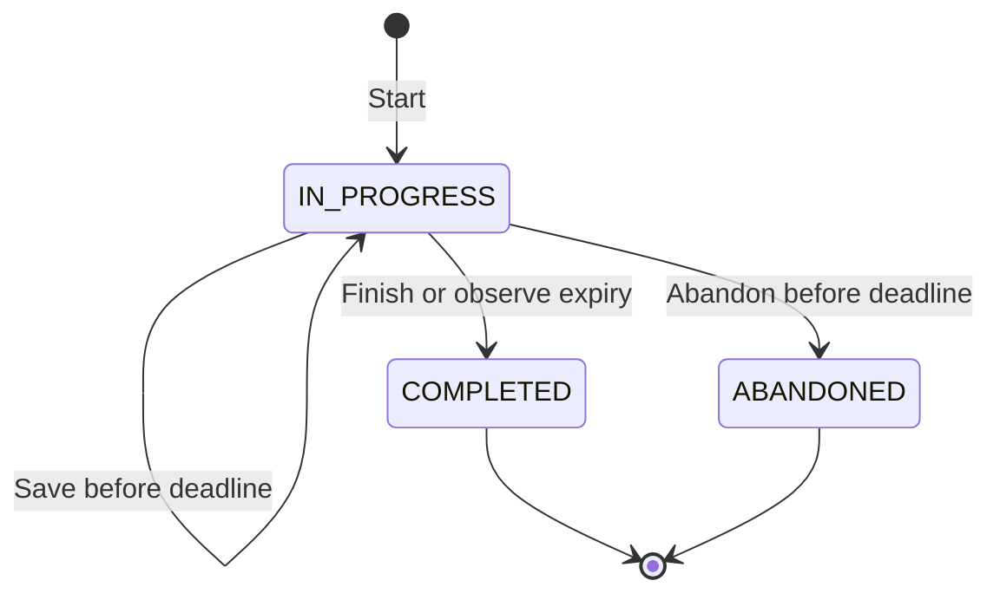

# Phase 15 — Timed mock interviews and private reflection reports

Phase 15 adds a complete mock-interview workflow: setup, random question selection, a timed session, saved written explanations, reference discussion and a private self-assessment report. [PR #16](https://github.com/zihadpcode/AlgoSprint/pull/16) records the exact tested head, CI evidence and merge result. Phase 14 was merged in [PR #15](https://github.com/zihadpcode/AlgoSprint/pull/15). Phase 16 polish and deployment are separate.

## 🟦 What gets built

| Route | Purpose |
| --- | --- |
| `/mock-interview` | Choose options, start/resume practice and browse your latest twenty sessions |
| `/mock-interview/[id]` | View frozen questions, watch the timer, write explanations, self-rate and explicitly save each response |
| `/interview-results/[id]` | Review saved responses, transparent scores, feedback and reference discussions |

Every route requires a verified signed-in viewer. Reads and writes are scoped to that viewer's database ID; another user, including another administrator, cannot read or finish your session. Existing proxy matchers already cover these paths with private/no-store headers. Server pages and actions independently enforce authorization near the data.

## 🟩 Try it locally

Use Node.js 24, the existing database migrations and configured Supabase accounts from the Phase 3 guide:

```bash
npm ci
npm run db:deploy
npm run db:seed
npm run dev
```

These database commands target your configured development database. Generation in Phase 14 did not add its draft fixtures to the default published seeds. Do not reset a database containing curated content to resolve a seed conflict.

Sign in and open Mock interviews in the workspace navigation. Choose 15, 30, 45 or 60 minutes and one to three questions. Difficulty, topic and question-style filters are optional. An insufficient pool returns a clear message; broaden filters or reduce the question count. The initial collection does not cover all topics and difficulty levels.

| Style | Source |
| --- | --- |
| Coding | Published coding problems in the library; explanations may include code or pseudocode |
| Conceptual | Original workshop badge-membership question comparing list scans and a hash set |
| Debugging | Original crate-count loop with an excluded final element |
| Optimization | Original repeated signed-ledger sums and update tradeoffs |
| Behavioral | Original teammate/demo handoff scenario; real examples or clearly labeled hypotheticals |
| System design | Original campus study-room booking scenario with concurrent reservation concerns |

The five authored noncoding prompts are currently Easy. Their topics are hash maps, arrays or design. Coding difficulty and categories come from the published library. Selection is uniform without replacement over the matching candidate list, using a cryptographic random integer in a Fisher–Yates shuffle. The current selection limit is 1,000 matching library candidates plus the five authored prompts; it rejects a larger matching library pool rather than silently biasing selection toward a truncated list.

There is one active session per owner. Starting again resumes that session, even if different filters were selected. An expired active session is finalized when starting another. At most twenty sessions can be created within a rolling 24-hour period. The index shows the latest twenty; older reports remain addressable by their owner but there is no older-history pagination UI in this phase.

## 🟨 A session from start to finish

1. Start a session. The server verifies the options and user, chooses distinct eligible questions, captures their content and records its start time.
2. For each question, write reasoning and a solution/code sketch, complexity or tradeoffs, and tests/examples/checks. Each field allows at most 4,000 characters.
3. Rate each of those areas from zero to two using the displayed rubric. These are your own assessments, not automatic judgments.
4. Press **Save answer** for each question. The UI indicates unsaved changes. Saving one answer does not save another question's draft.
5. Finish and review when ready. If text is unsaved, the UI asks you to copy it or cancel and save before ending. Abandoning also asks for confirmation and produces no score.
6. After the session ends, open each reference discussion and compare it with your saved explanation. Choose one weak area for another focused practice session.

This is an explanation-practice mode. The coding response can contain actual code or pseudocode, but the session does not execute it, contact Judge0 or automatically evaluate its correctness. Existing problem-page execution remains a separate feature. No interview action writes problem progress, notes or user submissions.

## 🟦 State and timing



The deadline is `startedAt + durationMinutes`. The server checks it after acquiring the session lock. The client countdown is a display, not the authority. It measures elapsed wall time and monotonic time to account for tab suspension where possible. Leaving the page does not pause a session; reopening uses the remaining server time.

At zero, answer controls are disabled and the UI instructs you to copy any unsaved text and open the report. There is no scheduled background worker: an expired row becomes completed when a save/finish/abandon request or a new start observes expiry. A page read does not mutate it. If no request happens, its database status can remain IN_PROGRESS beyond the deadline while late writes are still rejected.

If a save reaches the server after expiry, it finalizes the session using earlier saved answers and does not accept the late answer. The client keeps your late text visible to copy instead of immediately navigating away. Click **Open report** afterward. A late abandon is treated as completion on expiry, not as a way to erase the score. Repeating a terminal action returns the ended state without recalculating or changing the stored report.

The browser unload warning helps with ordinary page closes. It is not a draft recovery system, and in-app navigation may not show that warning. Save explicitly or copy text before navigating. No autosave, local storage of private responses or cross-device unsaved-draft sync is included.

## 🟨 How scoring works

Each question has three areas, each worth 0–2 self-rated points:

| Rating | Meaning |
| --- | --- |
| 0 | Not yet explained |
| 1 | Partial explanation |
| 2 | Clear explanation with support |

An empty or whitespace-only area earns zero regardless of the selected rating. Since the September 21 follow-up, each rating control starts on a “Choose a rating” placeholder and the client refuses to save an answer whose written area has no rating, so text is never silently scored as zero; a deliberately chosen 0 is still saved as 0, and the saved JSON contract is unchanged. The server computes a question's score as `round(points / 6 × 100)`. The overall score is the rounded average of all question scores, including unanswered questions. For example, one question with only reasoning rated two earns 33/100. In a two-question session, that answer plus one unanswered question produces 17/100 overall.

This intentionally measures the user's reflection, not correctness. A complete-looking answer can still be wrong, and self-rating two does not verify anything. The report says this explicitly and asks the learner to compare against the reference or obtain peer feedback. Scores are not hiring predictions or verified solves.

Feedback names areas that are empty or rated below two. If all three are rated complete, it encourages checking those judgments against the reference. Behavioral and system-design answers do not have a unique model answer; references are discussion points and tradeoffs, not mandatory scripts.

## 🟦 Internals and file connections

- `contracts.ts` defines strict setup, action and answer schemas. No user ID, client score, start time or deadline is accepted in a command. The session-view type omits reference content while active.
- `questions.ts` holds the five original noncoding prompts and their reference discussions. It remains on the server; client components do not import it.
- `policy.ts` restores validated answers, computes remaining time and calculates transparent self-assessment scores and feedback.
- `store.ts` owns selection, database locks, lifecycle changes, snapshotting and owner-scoped queries.
- `actions.ts` obtains the verified viewer ID, dispatches a validated command, revalidates private pages and returns safe messages instead of internal error details.
- `load.ts` requires the viewer before list/session/report queries and validates route IDs.
- `setup.tsx` handles pending starts and routes to the created or already active session.
- `session.tsx` holds local answer drafts and optimistic tokens, displays the timer, blocks duplicate requests and preserves text after conflicts or unconfirmed results.
- The three page modules render setup, active sessions and completed/abandoned reports in the existing workspace shell.
- Navigation and the signed-out HTTP smoke suite include the new routes.

### Database design

The existing `MockInterview` and `MockInterviewQuestion` models already provide the necessary fields, so this phase introduces no migration. A question's `prompt` text stores a version-1 JSON snapshot containing its title, statement, example/constraint details, reference discussion, optional library slug and content revision. A question's `answer` text stores validated JSON for the three response fields and their self-ratings. `score` and `feedback` store the finalized question assessment; the parent `report` stores the scoring method and whether expiry was observed.

This internal format is separate from the Phase 14 problem-seed JSON schema. Future migrations or imports of interview rows must preserve or explicitly migrate these versioned snapshots. Arbitrary historical text in those fields is not treated as a current-format interview snapshot.

Coding snapshots query published statements, constraints and examples, plus an optimal solution for later reference. They never query hidden test cases or another learner's data. During an active session, the query projection removes the entire reference field before returning a client-visible view. After completion or abandonment, it includes that field. Someone could still visit a public problem page independently; this is private practice, not a proctored examination.

Saved snapshots keep an interview coherent after a library edit or archive. The saved revision remains visible in its report. The problem relation retains the existing restrict-on-delete protection, so administrators cannot permanently delete referenced problems through the safe-delete workflow.

### Concurrency and ownership

Starting locks the verified user's database row. Two starts for the same user serialize; the second sees and resumes the already active session. The quota is checked under this lock. Selected coding problem rows are locked in stable ID order while copying their published content; if a selected problem has become unavailable, the entire start fails and the user can retry.

Saving, finishing and abandoning lock the owner-scoped interview row. Under that lock, a save confirms its question belongs to that session and compares a SHA-256 token of the stored answer to the client's baseline. Another tab's changed answer produces a conflict rather than an overwrite. The token advances only after confirmed success. An identical no-change save is harmless; this is content-based optimistic concurrency, not a general edit-history counter.

Finalization reads the saved answers under the same row lock, calculates every question score, then writes the parent score/status/report in the same transaction. A concurrent save cannot be interleaved halfway through finalization. The server does not trust incoming self-rated totals; only bounded per-area ratings and text are accepted.

## 🟩 Verification

```bash
npm test
npm run lint
npm run typecheck
npm run build
npm run test:smoke
```

Use `npm run test:integration` only after applying migrations to a dedicated empty PostgreSQL database whose name ends in `_test`, supplied through `TEST_DATABASE_URL`. GitHub CI supplies PostgreSQL 17 and executes the complete application gates.

Local verification: **170 tests pass**, including twelve new policy, action/loader and client-session tests. Lint, typecheck, production build and signed-out HTTP smoke pass. **All 73 PostgreSQL integration tests also pass, for 243 tests total.** [Implementation CI 35426555640](https://github.com/zihadpcode/AlgoSprint/actions/runs/35426555640) passed every step on `94701ddc60aa3fadb3d61ef18c3e690b9dd364ab`, including migrations, fixture/seed validation, all tests, lint/types/build, seeding and both HTTP suites. PR #16 records final documentation-head CI and merge evidence.

New integration coverage checks distinct published selection, hidden-reference projection, ownership even against another administrator, duplicate starts, conflicting saves, late writes, self-assessment without progress mutation, idempotent completion, frozen content, abandonment, noncoding filters, expired-session restart and the rolling creation limit.

### Live checklist still to perform

With real configured accounts, verify sign-in and resumption, navigate between devices/tabs, save three responses, compare a finished report, and confirm another account cannot access the URLs. Check keyboard focus, screen-reader labels, timer expiration after sleep/backgrounding, narrow layouts, 200% zoom and confirmation dialogs. Existing Supabase/Judge0/Monaco live checks remain pending. Automated DOM tests and signed-out HTTP checks do not establish live authenticated browser behavior.

## 🟥 Common mistakes

- Calling a self-assessment score an automated correctness score. The report is for reflection.
- Assuming the timer pauses on navigation or that unsaved text is autosaved. It does neither.
- Believing a browser-clock edit changes the deadline. The server deadline controls acceptance.
- Sending a user ID from the client and trusting it. Every action/query derives ownership from the verified account.
- Returning a full prompt snapshot to the active client. Its reference is removed before serialization.
- Expecting all filters to have enough questions in the small starter collection. Insufficient pools fail without creating a partial session.
- Treating the score as proof of coding execution. No submitted answer strings are evaluated here.
- Adding an interview mutation path that omits the current row locks, ownership checks or answer-token comparison.

## 🟪 Next phase

Phase 16 is polish and deployment. Before deployment, perform the live account/browser checklist and configure intended environments deliberately. Possible later interview enhancements include autosave with conflict recovery, more original questions, older-history pagination, explicit peer review, audio practice and separately reviewed execution integration. None is required for this completed explanation-practice workflow.

## 🟩 Complete changed implementation and test files

Every changed source, script and test file follows in full. Documentation is described above instead of recursively embedding this guide.

### `scripts/smoke-auth.mjs`

```js
import assert from "node:assert/strict";
import { spawn } from "node:child_process";
import { setTimeout as delay } from "node:timers/promises";

const origin = "http://127.0.0.1:3100";
const server = spawn(process.execPath, ["node_modules/next/dist/bin/next", "start", "--hostname", "127.0.0.1", "--port", "3100"], {
  env: { ...process.env, DATABASE_URL: "", DIRECT_URL: "", NEXT_PUBLIC_SUPABASE_URL: "", NEXT_PUBLIC_SUPABASE_PUBLISHABLE_KEY: "", APP_URL: "", NEXT_TELEMETRY_DISABLED: "1" },
  stdio: ["ignore", "pipe", "pipe"],
});
let diagnostic = "";
const collect = (chunk) => { diagnostic = (diagnostic + chunk.toString()).slice(-5000); };
server.stderr.on("data", collect);
server.stdout.on("data", collect);
try {
  let ready = false;
  let lastFailure = "No response yet";
  for (let i = 0; i < 100; i++) {
    if (server.exitCode !== null) throw new Error(`Server exited: ${diagnostic}`);
    try {
      const response = await fetch(origin, { signal: AbortSignal.timeout(2000) });
      if (response.ok) { ready = true; break; }
      lastFailure = `HTTP ${response.status}: ${(await response.text()).slice(0, 500)}`;
    } catch (error) { lastFailure = String(error); }
    await delay(200);
  }
  assert.ok(ready, `Production server must become ready: ${lastFailure}\n${diagnostic}`);
  for (const path of ["/mock-interview", "/mock-interview/00000000-0000-4000-8000-000000000000", "/interview-results/00000000-0000-4000-8000-000000000000", "/dashboard", "/progress", "/profile", "/admin", "/admin/problems/new", "/admin/problems/relay-window", "/admin/import", "/admin/roadmaps/scan-store-reuse", "/notes", "/bookmarks", "/review"]) {
    const response = await fetch(origin + path, { redirect: "manual", headers: { cookie: "sb-access-token=forged; role=ADMIN" } });
    assert.equal(response.status, 307, `${path}: ${diagnostic}`);
    assert.ok(response.headers.get("location")?.startsWith("/login?next="), path);
  }
  for (const path of ["/login", "/register"]) {
    const response = await fetch(origin + path); assert.equal(response.status, 200, path);
    assert.ok((await response.text()).includes("Accounts are being prepared"), path);
  }
  for (const path of ["/not-a-real-route", "/ui-check"]) {
    const missing = await fetch(origin + path);
    assert.equal(missing.status, 404, path);
    assert.ok((await missing.text()).includes("This page isn’t available"), path);
  }
  const library = await fetch(origin + "/problems");
  assert.equal(library.status, 200);
  assert.ok((await library.text()).includes("The library is being prepared"));
  const detail = await fetch(origin + "/problems/relay-window");
  assert.equal(detail.status, 200);
  assert.ok((await detail.text()).includes("Practice is being prepared"));
  assert.equal((await fetch(origin + "/problems/INVALID")).status, 404);
  for (const path of ["/roadmaps", "/roadmaps/scan-store-reuse"]) {
    const response = await fetch(origin + path); assert.equal(response.status, 200);
    assert.ok((await response.text()).includes("Roadmaps are being prepared"));
  }
  assert.equal((await fetch(origin + "/roadmaps/INVALID")).status, 404);
  const callback = await fetch(origin + "/auth/callback?code=forged", { redirect: "manual" });
  assert.equal(callback.status, 503); assert.match(callback.headers.get("cache-control") ?? "", /(?:^|,\s*)no-store(?:,|$)/);
  console.log("Production HTTP smoke passed: landing, protected redirects, missing-config forms, custom 404, and callback denial.");
} finally {
  server.kill("SIGTERM");
  await Promise.race([new Promise((resolve) => server.once("exit", resolve)), delay(3000)]);
  if (server.exitCode === null) server.kill("SIGKILL");
}
```

### `src/app/interview-results/[id]/page.tsx`

```tsx
import type { Metadata } from "next";
import { notFound, redirect } from "next/navigation";
import { AppShell } from "@/components/layout/app-shell";
import { PageHeading } from "@/components/ui/page-heading";
import { Card } from "@/components/ui/card";
import { ButtonLink } from "@/components/ui/button";
import { loadInterview } from "@/features/interviews/load";
export const metadata: Metadata = { title: "Interview report", robots: { index: false, follow: false } };
export const dynamic = "force-dynamic";
export default async function ReportPage({ params }: { params: Promise<{ id: string }> }) {
  const view = await loadInterview((await params).id, true); if (!view) notFound();
  const { session } = view; if (session.status === "IN_PROGRESS") redirect(`/mock-interview/${session.id}`);
  return <AppShell signedIn admin={view.viewer.role === "ADMIN"}><PageHeading eyebrow="Reflect and improve" title="Interview report" description={session.status === "ABANDONED" ? "Session abandoned. Saved responses remain available; no score was assigned." : `Self-assessment: ${session.score ?? 0}/100. This is your rating of your explanation, not an automated correctness result.`} />
    <Card><h2 className="text-xl font-semibold">How to read this report</h2><p className="mt-3 text-sm leading-7 text-muted">Each question has three self-rated areas worth 0–2 points: reasoning, tradeoffs and checks. Empty areas earn zero. A question score is its points divided by six, rounded to 100; the overall score averages all question scores, including unanswered questions. Compare your explanation with the reference below and choose one area to practice next. This session does not change problem progress or verified solves.</p></Card>
    <div className="mt-6 space-y-6">{session.questions.map((q) => <Card key={q.id}><h2 className="text-xl font-semibold">{q.position}. {q.prompt.title}</h2><p className="mt-3 whitespace-pre-wrap text-sm leading-7">{q.prompt.statement}</p>
      <p className="mt-3 text-sm font-medium">{q.score === null ? "Not scored" : `Self-assessment ${q.score}/100`}</p><p className="mt-2 text-sm text-muted">{q.feedback}</p>
      {([ ["reasoning", "Reasoning and solution"], ["tradeoffs", "Complexity and tradeoffs"], ["checks", "Tests and checks"] ] as const).map(([key, label]) => <section className="mt-5" key={key}><h3 className="font-semibold">{label}</h3><pre className="mt-2 whitespace-pre-wrap break-words text-sm leading-7">{q.answer[key] || "No saved response."}</pre></section>)}
      <details className="mt-6 rounded-xl border border-line p-4"><summary className="cursor-pointer font-semibold">Reference discussion</summary><pre className="mt-3 whitespace-pre-wrap break-words text-sm leading-7">{q.reference}</pre></details>
      {q.prompt.revision !== null && <p className="mt-3 text-xs text-muted">Saved problem revision {q.prompt.revision}. Later library edits do not change this report.</p>}
    </Card>)}</div><div className="mt-6"><ButtonLink href="/mock-interview">Back to interviews</ButtonLink></div>
  </AppShell>;
}
```

### `src/app/mock-interview/[id]/page.tsx`

```tsx
import type { Metadata } from "next";
import { notFound, redirect } from "next/navigation";
import { AppShell } from "@/components/layout/app-shell";
import { PageHeading } from "@/components/ui/page-heading";
import { InterviewSession } from "@/components/interviews/session";
import { loadInterview } from "@/features/interviews/load";
export const metadata: Metadata = { title: "Interview session", robots: { index: false, follow: false } };
export const dynamic = "force-dynamic";
export default async function SessionPage({ params }: { params: Promise<{ id: string }> }) {
  const view = await loadInterview((await params).id); if (!view) notFound();
  if (view.session.status !== "IN_PROGRESS") redirect(`/interview-results/${view.session.id}`);
  return <AppShell signedIn admin={view.viewer.role === "ADMIN"}><PageHeading eyebrow="Deliberate practice" title="Your interview session" description="Write your reasoning, code or pseudocode, tradeoffs and checks. Save each response explicitly." /><InterviewSession key={view.session.id} session={view.session} /></AppShell>;
}
```

### `src/app/mock-interview/page.tsx`

```tsx
import type { Metadata } from "next";
import { AppShell } from "@/components/layout/app-shell";
import { PageHeading } from "@/components/ui/page-heading";
import { Card } from "@/components/ui/card";
import { ButtonLink } from "@/components/ui/button";
import { InterviewSetup } from "@/components/interviews/setup";
import { loadInterviewIndex } from "@/features/interviews/load";
export const metadata: Metadata = { title: "Mock interviews", robots: { index: false, follow: false } };
export const dynamic = "force-dynamic";
export default async function InterviewPage() {
  const { viewer, items } = await loadInterviewIndex();
  return <AppShell signedIn admin={viewer.role === "ADMIN"}><PageHeading eyebrow="Explain your thinking" title="Mock interviews" description="Timed, private practice with original questions and a self-assessment report." />
    <Card><h2 className="mb-5 text-xl font-semibold">Set up a session</h2><InterviewSetup /></Card>
    <h2 className="mt-8 mb-4 text-xl font-semibold">Your latest 20 sessions</h2>
    {!items.length ? <p className="text-muted">Your sessions will appear here after you start one.</p> : <ul className="space-y-3">{items.map((item) => <li key={item.id}><Card><p className="mb-3 text-sm">{item.createdAt.toISOString().slice(0, 16).replace("T", " ")} UTC · {item.durationMinutes} minutes · {item.status.replaceAll("_", " ")}{item.score !== null && ` · Self-assessment ${item.score}/100`}</p><ButtonLink href={item.status === "IN_PROGRESS" ? `/mock-interview/${item.id}` : `/interview-results/${item.id}`} variant="secondary">{item.status === "IN_PROGRESS" ? "Resume / finish" : "View report"}</ButtonLink></Card></li>)}</ul>}
    <p className="mt-6 text-sm text-muted">One active session at a time; starting again resumes it. Up to 20 new sessions per 24 hours. Scores are personal reflections, not verified solves or hiring predictions.</p>
  </AppShell>;
}
```

### `src/components/interviews/session.tsx`

```tsx
"use client";
import { useEffect, useRef, useState } from "react";
import { useRouter } from "next/navigation";
import { Button } from "@/components/ui/button";
import { Select } from "@/components/ui/input";
import { Card } from "@/components/ui/card";
import { interviewAction } from "@/features/interviews/actions";
import type { SessionView } from "@/features/interviews/contracts";

export function InterviewSession({ session }: { session: SessionView }) {
  const router = useRouter(); const busy = useRef(false);
  const [drafts, setDrafts] = useState(session.questions.map((q) => q.answer));
  const [tokens, setTokens] = useState(session.questions.map((q) => q.token));
  const [saved, setSaved] = useState(session.questions.map((q) => JSON.stringify(q.answer)));
  const [pending, setPending] = useState(false); const [message, setMessage] = useState("");
  const [remaining, setRemaining] = useState(session.remainingMs); const baseline = useRef<number | null>(null);
  const dirty = drafts.some((d, i) => JSON.stringify(d) !== saved[i]);
  useEffect(() => {
    baseline.current = performance.now(); const wallStart = Date.now();
    const tick = () => setRemaining(Math.max(0, session.remainingMs - Math.max(Date.now() - wallStart, performance.now() - baseline.current!)));
    const timer = setInterval(tick, 500); window.addEventListener("focus", tick);
    return () => { clearInterval(timer); window.removeEventListener("focus", tick); };
  }, [session.id, session.remainingMs]);
  useEffect(() => {
    const warn = (event: BeforeUnloadEvent) => { if (dirty) event.preventDefault(); };
    window.addEventListener("beforeunload", warn); return () => window.removeEventListener("beforeunload", warn);
  }, [dirty]);
  const seconds = Math.ceil(remaining / 1000);
  async function send(operation: "save" | "finish" | "abandon", index?: number) {
    if (busy.current) return;
    if (operation !== "save" && dirty && !window.confirm("Unsaved text will not be included. Copy it or cancel and save each answer first. End this session?")) return;
    if (operation === "abandon" && !window.confirm("Abandon this session without a score? Saved answers will remain in its report.")) return;
    busy.current = true; setPending(true);
    try {
      const result = await interviewAction(operation === "save" ? { operation, id: session.id, questionId: session.questions[index!].id, token: tokens[index!], answer: drafts[index!] } : { operation, id: session.id });
      setMessage(result.message);
      if (result.success && result.ended) { if (operation === "save") { setRemaining(0); setMessage(`${result.message} Your text remains here to copy before opening the report.`); } else router.push(`/interview-results/${session.id}`); return; }
      if (result.success && result.token && index !== undefined) { setTokens((a) => a.map((t, i) => i === index ? result.token! : t)); setSaved((a) => a.map((s, i) => i === index ? JSON.stringify(drafts[index]) : s)); }
    } catch { setMessage("Could not confirm the save. Copy your draft, then reload to check the saved version."); }
    finally { busy.current = false; setPending(false); }
  }
  return <div className="space-y-6">
    <Card><p className="text-lg font-semibold" role="timer" aria-label="Time remaining">{Math.floor(seconds / 60)}:{String(seconds % 60).padStart(2, "0")} remaining</p>
      <p className="mt-2 text-sm text-muted">The timer continues when you leave. Save each answer before the deadline. References unlock when the session ends.</p>
      {seconds === 0 && <p role="alert" className="mt-3 text-warm">Time is up. Copy any unsaved text if needed, then open the report. Only answers received before the server deadline count.</p>}
      <p role="status" className="mt-3 text-sm">{message}</p>
    </Card>
    {session.questions.map((q, index) => <Card key={q.id}>
      <p className="eyebrow text-xs text-muted">Question {q.position} · {q.kind.replaceAll("_", " ")}</p><h2 className="mt-3 text-xl font-semibold">{q.prompt.title}</h2>
      <p className="mt-4 whitespace-pre-wrap text-sm leading-7">{q.prompt.statement}</p><pre className="mt-4 whitespace-pre-wrap break-words text-sm leading-7 text-muted">{q.prompt.details}</pre>
      <fieldset disabled={pending || seconds === 0} className="mt-5 space-y-5"><legend className="mb-3 font-semibold">Your explanation and self-assessment</legend>
        {([ ["reasoning", "reasoningRating", "Reasoning and solution / code"], ["tradeoffs", "tradeoffsRating", "Complexity and tradeoffs"], ["checks", "checksRating", "Tests, examples and checks"] ] as const).map(([field, rating, label]) => <div key={field} className="space-y-2">
          <label htmlFor={`${q.id}-${field}`} className="block text-sm font-medium">{label}</label>
          <textarea id={`${q.id}-${field}`} maxLength={4000} rows={5} className="w-full rounded-xl border border-line bg-canvas p-3 text-sm" value={drafts[index][field]} onChange={(e) => setDrafts((a) => a.map((d, i) => i === index ? { ...d, [field]: e.target.value } : d))} />
          <label className="block text-sm text-muted">Self-rating for {label.toLowerCase()}<Select value={drafts[index][rating]} onChange={(e) => setDrafts((a) => a.map((d, i) => i === index ? { ...d, [rating]: Number(e.target.value) } : d))}><option value="0">0 — Not yet explained</option><option value="1">1 — Partial explanation</option><option value="2">2 — Clear explanation with support</option></Select></label>
        </div>)}
        <Button onClick={() => send("save", index)}>{pending ? "Working…" : "Save answer"}</Button><span className="ml-3 text-xs text-muted">{JSON.stringify(drafts[index]) === saved[index] ? "No unsaved changes" : "Unsaved changes"}</span>
      </fieldset>
    </Card>)}
    <div className="flex flex-wrap gap-3"><Button disabled={pending} onClick={() => send("finish")}>{seconds === 0 ? "Open report" : "Finish and review"}</Button><Button disabled={pending} variant="secondary" onClick={() => send("abandon")}>Abandon session</Button></div>
  </div>;
}
```

### `src/components/interviews/setup.tsx`

```tsx
"use client";
import { useRef, useState } from "react";
import { useRouter } from "next/navigation";
import { Button } from "@/components/ui/button";
import { Select } from "@/components/ui/input";
import { CATEGORIES } from "@/data/seeds/taxonomy";
import { KINDS } from "@/features/interviews/contracts";
import { interviewAction } from "@/features/interviews/actions";
export function InterviewSetup() {
  const router = useRouter(); const busy = useRef(false); const [pending, setPending] = useState(false); const [message, setMessage] = useState("");
  return <form className="space-y-5" onSubmit={async (event) => {
    event.preventDefault(); if (busy.current) return; busy.current = true; setPending(true);
    const data = new FormData(event.currentTarget);
    try {
      const result = await interviewAction({ operation: "start", setup: { duration: Number(data.get("duration")), count: Number(data.get("count")), difficulty: data.get("difficulty"), kind: data.get("kind"), topic: data.get("topic") } });
      setMessage(result.message); if (result.success && result.id) router.push(`/mock-interview/${result.id}`);
    } catch { setMessage("Could not confirm the start. Reload to find an existing session before retrying."); }
    finally { busy.current = false; setPending(false); }
  }}>
    <div className="grid gap-5 sm:grid-cols-2">
      <label className="space-y-2">Duration<Select name="duration" defaultValue="30" disabled={pending}>{[15, 30, 45, 60].map((n) => <option key={n} value={n}>{n} minutes</option>)}</Select></label>
      <label className="space-y-2">Questions<Select name="count" defaultValue="2" disabled={pending}>{[1, 2, 3].map((n) => <option key={n}>{n}</option>)}</Select></label>
      <label className="space-y-2">Difficulty<Select name="difficulty" disabled={pending}>{["ANY", "EASY", "MEDIUM", "HARD"].map((v) => <option key={v}>{v}</option>)}</Select></label>
      <label className="space-y-2">Question style<Select name="kind" disabled={pending}>{["ANY", ...KINDS].map((v) => <option key={v} value={v}>{v.replaceAll("_", " ")}</option>)}</Select></label>
      <label className="space-y-2 sm:col-span-2">Topic<Select name="topic" disabled={pending}><option value="">Any topic</option>{CATEGORIES.map(([slug, label]) => <option key={slug} value={slug}>{label}</option>)}</Select></label>
    </div>
    <p className="text-sm leading-7 text-muted">Practice explaining a solution, writing code or pseudocode, and defending your choices. Rate your own reasoning, tradeoffs and checks. This mode does not execute code or judge correctness. The small starter collection may not cover every filter.</p>
    <Button type="submit" disabled={pending}>{pending ? "Starting…" : "Start timed practice"}</Button>
    <p role="status" className="text-sm text-muted">{message}</p>
  </form>;
}
```

### `src/components/layout/workspace-nav.tsx`

```tsx
"use client";
import Link from "next/link";
import { usePathname } from "next/navigation";
import { LayoutDashboard, UserRound, ShieldCheck, BookOpen, Route } from "lucide-react";
import { cn } from "@/lib/utils";
const links = [ { href: "/mock-interview", label: "Mock interviews", icon: BookOpen }, { href: "/roadmaps", label: "Roadmaps", icon: Route }, { href: "/problems", label: "Problems", icon: BookOpen }, { href: "/dashboard", label: "Dashboard", icon: LayoutDashboard }, { href: "/progress", label: "Progress", icon: BookOpen }, { href: "/notes", label: "Notes", icon: BookOpen }, { href: "/bookmarks", label: "Bookmarks", icon: BookOpen }, { href: "/review", label: "Review later", icon: BookOpen }, { href: "/profile", label: "Profile", icon: UserRound } ];
export function WorkspaceNav({ admin = false }: { admin?: boolean }) {
  const pathname = usePathname();
  const items = admin ? [...links, { href: "/admin", label: "Admin", icon: ShieldCheck }] : links;
  return <nav aria-label="Workspace navigation"><ul className="flex gap-2 overflow-x-auto p-2 lg:flex-col">
    {items.map(({ href, label, icon: Icon }) => {
      const active = pathname === href || pathname.startsWith(`${href}/`);
      return <li key={href} className="shrink-0"><Link href={href} aria-current={active ? "page" : undefined} className={cn("flex min-h-12 items-center gap-3 rounded-xl border px-4 py-3 text-sm font-medium transition-colors", active ? "border-accent/25 bg-accent/10 text-accent" : "border-transparent text-muted hover:bg-surface-raised hover:text-ink")}><Icon aria-hidden="true" size={18} />{label}</Link></li>;
    })}
  </ul></nav>;
}
```

### `src/features/interviews/actions.ts`

```ts
"use server";
import { revalidatePath } from "next/cache";
import { ZodError } from "zod";
import { getViewer } from "@/features/auth/session";
import { getDatabase } from "@/lib/prisma";
import { InterviewError, writeInterview } from "./store";
import type { InterviewResult } from "./contracts";
export async function interviewAction(raw: unknown): Promise<InterviewResult> {
  try {
    const viewer = await getViewer();
    if (!viewer) return { success: false, message: "Sign in to continue. Keep a copy of your draft." };
    const result = await writeInterview(getDatabase(), viewer.id, raw);
    revalidatePath("/mock-interview");
    revalidatePath("/mock-interview/[id]", "page");
    revalidatePath("/interview-results/[id]", "page");
    return result;
  } catch (error) {
    if (error instanceof InterviewError) return { success: false, message: error.message };
    if (error instanceof ZodError) return { success: false, message: "Check the interview options and answer lengths (4,000 characters per field)." };
    return { success: false, message: "Could not confirm the request. Keep a copy of your draft and reload to check the saved state before retrying." };
  }
}
```

### `src/features/interviews/contracts.ts`

```ts
import { z } from "zod";
import { CATEGORIES } from "@/data/seeds/taxonomy";
export const KINDS = ["CODING", "CONCEPTUAL", "DEBUGGING", "OPTIMIZATION", "BEHAVIORAL", "SYSTEM_DESIGN"] as const;
const text = z.string().max(4000).refine((s) => !s.includes("\u0000"), "Remove null characters");
export const answerSchema = z.strictObject({ reasoning: text, tradeoffs: text, checks: text, reasoningRating: z.int().min(0).max(2), tradeoffsRating: z.int().min(0).max(2), checksRating: z.int().min(0).max(2) });
export type InterviewAnswer = z.infer<typeof answerSchema>;
export const EMPTY_ANSWER: InterviewAnswer = { reasoning: "", tradeoffs: "", checks: "", reasoningRating: 0, tradeoffsRating: 0, checksRating: 0 };
export const setupSchema = z.strictObject({ duration: z.union([z.literal(15), z.literal(30), z.literal(45), z.literal(60)]), count: z.int().min(1).max(3), difficulty: z.enum(["ANY", "EASY", "MEDIUM", "HARD"]), kind: z.enum(["ANY", ...KINDS]), topic: z.string().refine((v) => v === "" || CATEGORIES.some(([slug]) => slug === v)) });
export const interviewCommand = z.discriminatedUnion("operation", [
  z.strictObject({ operation: z.literal("start"), setup: setupSchema }),
  z.strictObject({ operation: z.literal("save"), id: z.uuid(), questionId: z.uuid(), token: z.string().regex(/^[a-f0-9]{64}$/), answer: answerSchema }),
  z.strictObject({ operation: z.literal("finish"), id: z.uuid() }),
  z.strictObject({ operation: z.literal("abandon"), id: z.uuid() }),
]);
export type InterviewResult = { success: boolean; message: string; id?: string; token?: string; ended?: boolean };
export const snapshotSchema = z.object({ version: z.literal(1), title: z.string(), statement: z.string(), details: z.string(), reference: z.string(), revision: z.number().nullable(), slug: z.string().nullable() });
export type Snapshot = z.infer<typeof snapshotSchema>;
export type SessionView = { id: string; status: string; duration: number; remainingMs: number; score: number | null; questions: { id: string; position: number; kind: string; prompt: Omit<Snapshot, "reference">; reference?: string; answer: InterviewAnswer; token: string; score: number | null; feedback: string | null }[] };
```

### `src/features/interviews/load.ts`

```ts
import "server-only";
import { z } from "zod";
import { requireViewer } from "@/features/auth/session";
import { getDatabase } from "@/lib/prisma";
import { queryInterview, queryInterviews } from "./store";
export async function loadInterviewIndex() {
  const viewer = await requireViewer("/mock-interview");
  return { viewer, items: await queryInterviews(getDatabase(), viewer.id) };
}
export async function loadInterview(id: string, report = false) {
  const viewer = await requireViewer(report ? `/interview-results/${id}` : `/mock-interview/${id}`);
  if (!z.uuid().safeParse(id).success) return null;
  const session = await queryInterview(getDatabase(), viewer.id, id);
  return session ? { viewer, session } : null;
}
```

### `src/features/interviews/policy.ts`

```ts
import { answerSchema, EMPTY_ANSWER, type InterviewAnswer } from "./contracts";
export function readAnswer(value: string | null): InterviewAnswer {
  return value === null ? { ...EMPTY_ANSWER } : answerSchema.parse(JSON.parse(value));
}
export function remainingMs(startedAt: Date, duration: number, now = new Date()) {
  return Math.max(0, Math.min(duration * 60000, startedAt.getTime() + duration * 60000 - now.getTime()));
}
export function assessment(answer: InterviewAnswer) {
  const dimensions = [["reasoning", "reasoningRating"], ["tradeoffs", "tradeoffsRating"], ["checks", "checksRating"]] as const;
  const points = dimensions.reduce((sum, [field, rating]) => sum + (answer[field].trim() ? answer[rating] : 0), 0);
  const improve = dimensions.filter(([field, rating]) => !answer[field].trim() || answer[rating] < 2).map(([field]) => field);
  return { score: Math.round(points / 6 * 100), feedback: improve.length ? `Next practice: strengthen ${improve.join(", ")}. Compare your response with the reference discussion.` : "You rated all three areas complete. Verify those judgments against the reference and ask a peer for feedback." };
}
```

### `src/features/interviews/questions.ts`

```ts
import type { Snapshot } from "./contracts";
import type { QuestionKind } from "@/generated/prisma/client";
type Question = { id: string; kind: QuestionKind; difficulty: "EASY" | "MEDIUM" | "HARD"; topic: string; snapshot: Snapshot };
const question = (id: string, kind: QuestionKind, topic: string, title: string, statement: string, reference: string): Question => ({ id, kind, topic, difficulty: "EASY", snapshot: { version: 1, title, statement, details: "Explain your reasoning, discuss costs or tradeoffs, and give a concrete check or example.", reference, revision: null, slug: null } });
export const INTERVIEW_QUESTIONS: Question[] = [
  question("collection-membership", "CONCEPTUAL", "hash-maps", "Workshop Check-In Index", "A workshop checks whether each arriving badge ID is on a registration list. Compare scanning the list for every arrival with building a hash set once. Explain duplicate IDs, expected time, worst-case qualifications and extra memory.", "A list scan costs O(n) per arrival, or O(nm) for m arrivals. Building a hash set takes expected O(n) time and O(n) extra memory; m membership checks take expected O(m). Duplicates collapse if only membership matters. Hash performance depends on the implementation and collisions; expected constant time is not a universal worst-case guarantee. Test registered, missing and repeated IDs."),
  question("last-crate", "DEBUGGING", "arrays", "The Missing Final Crate", "A depot counts positive crate weights using: let count = 0; for (let i = 0; i < weights.length - 1; i++) { if (weights[i] > 0) count++; } return count; Find the defect, propose the smallest correction, and describe tests that would catch it.", "The loop excludes the last index. Use i < weights.length. With [4] the faulty loop returns 0 instead of 1; [0, 3] isolates a positive final element. Also test [], all nonpositive values and multiple positives. A full scan costs O(n) time and O(1) extra space."),
  question("repeated-ledger", "OPTIMIZATION", "arrays", "Repeated Depot Totals", "An immutable ledger has n signed changes. A service answers q half-open range-sum requests by scanning each requested range. Propose a faster design for many requests, explain its cost, and describe what changes if ledger entries can be edited frequently.", "Use n+1 prefix totals with prefix[0]=0; answer [a,b) with prefix[b]-prefix[a]. Preprocessing takes O(n), each query O(1), and extra memory O(n), for O(n+q) total. Frequent point updates make rebuilding expensive; discuss a Fenwick tree or segment tree with O(log n) update/query costs. Check empty ranges, negative values and an end equal to n."),
  question("handoff-decision", "BEHAVIORAL", "design", "A Handoff Under Pressure", "A teammate asks you to merge a feature shortly before a demo, but you find an untested failure case. Describe how you would communicate the issue, decide what to ship, and follow up. Use a real experience if you have one; otherwise clearly label a hypothetical response.", "Describe the situation and your responsibility, then the specific risk and evidence. Offer proportionate choices such as a fix with a focused check, a reduced demo scope or a rollback plan. Explain whom you involve, how you avoid blame, and how you document the decision. Conclude with the outcome or expected outcome and a follow-up improvement. Do not invent a personal achievement."),
  question("study-room-booking", "SYSTEM_DESIGN", "design", "Campus Study Room Booking", "Sketch a small campus room-booking service. Students browse availability and reserve one room for a time interval. Explain the data model, how you prevent overlapping reservations during concurrent requests, and how you handle retries. Start with one campus rather than global scale.", "Clarify interval boundaries, cancellations and identity. Model rooms, users and bookings; validate times and authorization on the server. A database exclusion constraint on room/time ranges, or a transaction with appropriate locking, prevents concurrent overlaps; an availability check alone is insufficient. Use an idempotency key for retries. Index lookup paths, return conflicts clearly and test two competing reservations, touching intervals and canceled bookings."),
];
```

### `src/features/interviews/store.ts`

```ts
import "server-only";
import { createHash, randomInt } from "node:crypto";
import { Prisma, type PrismaClient } from "@/generated/prisma/client";
import { interviewCommand, snapshotSchema, type SessionView } from "./contracts";
import { INTERVIEW_QUESTIONS } from "./questions";
import { assessment, readAnswer, remainingMs } from "./policy";
export class InterviewError extends Error {}
export const answerToken = (value: string | null) => createHash("sha256").update(value ?? "").digest("hex");
const sessionInclude = { questions: { orderBy: { position: "asc" as const } } };
type Session = Prisma.MockInterviewGetPayload<{ include: typeof sessionInclude }>;
async function complete(tx: Prisma.TransactionClient, session: Session, abandoned = false) {
  const scores = session.questions.map((q) => ({ id: q.id, ...assessment(readAnswer(q.answer)) }));
  if (!abandoned) for (const q of scores) await tx.mockInterviewQuestion.update({ where: { id: q.id }, data: { score: q.score, feedback: q.feedback } });
  await tx.mockInterview.update({ where: { id: session.id }, data: { status: abandoned ? "ABANDONED" : "COMPLETED", completedAt: new Date(), score: abandoned ? null : Math.round(scores.reduce((s, q) => s + q.score, 0) / Math.max(1, scores.length)), report: { version: 1, method: "Self-assessed reasoning, tradeoffs and checks. Not an automated correctness score.", expired: remainingMs(session.startedAt!, session.durationMinutes) === 0 } } });
}
export async function writeInterview(db: PrismaClient, userId: string, raw: unknown) {
  const command = interviewCommand.parse(raw);
  return db.$transaction(async (tx) => {
    if (command.operation === "start") {
      const user = await tx.$queryRaw<{ id: string }[]>`SELECT id FROM app."User" WHERE id=${userId}::uuid FOR UPDATE`;
      if (!user.length) throw new InterviewError("Sign in to start an interview.");
      const active = await tx.mockInterview.findFirst({ where: { userId, status: "IN_PROGRESS" }, include: sessionInclude });
      if (active && remainingMs(active.startedAt!, active.durationMinutes) > 0) return { success: true, message: "Resuming your active session.", id: active.id };
      if (active) { await tx.$queryRaw`SELECT id FROM app."MockInterview" WHERE id=${active.id}::uuid FOR UPDATE`; const fresh = await tx.mockInterview.findUniqueOrThrow({ where: { id: active.id }, include: sessionInclude }); if (fresh.status === "IN_PROGRESS") await complete(tx, fresh); }
      const recent = await tx.mockInterview.count({ where: { userId, createdAt: { gte: new Date(Date.now() - 86400000) } } });
      if (recent >= 20) throw new InterviewError("You have reached 20 sessions in 24 hours. Review a saved report and return later.");
      const { difficulty, kind, topic, count, duration } = command.setup;
      const candidates: { id: string; library: boolean }[] = INTERVIEW_QUESTIONS.filter((q) => (kind === "ANY" || q.kind === kind) && (difficulty === "ANY" || q.difficulty === difficulty) && (!topic || q.topic === topic)).map((q) => ({ id: q.id, library: false }));
      if (kind === "ANY" || kind === "CODING") {
        const rows = await tx.problem.findMany({ where: { status: "PUBLISHED", kind: "CODING", ...(difficulty === "ANY" ? {} : { difficulty }), ...(topic ? { categories: { some: { category: { slug: topic } } } } : {}) }, select: { id: true }, take: 1001, orderBy: { id: "asc" } });
        if (rows.length > 1000) throw new InterviewError("This collection exceeds the current interview selection limit.");
        candidates.push(...rows.map((p) => ({ id: p.id, library: true })));
      }
      if (candidates.length < count) throw new InterviewError(`Only ${candidates.length} matching questions are available. Reduce the count or broaden your filters.`);
      for (let i = candidates.length - 1; i > 0; i--) { const j = randomInt(i + 1); [candidates[i], candidates[j]] = [candidates[j], candidates[i]]; }
      const selected = candidates.slice(0, count); const ids = selected.filter((c) => c.library).map((c) => c.id).sort();
      if (ids.length) await tx.$queryRaw(Prisma.sql`SELECT id FROM app."Problem" WHERE id IN (${Prisma.join(ids.map((id) => Prisma.sql`${id}::uuid`))}) ORDER BY id FOR SHARE`);
      const problems = await tx.problem.findMany({ where: { id: { in: ids }, status: "PUBLISHED" }, select: { id: true, slug: true, title: true, statement: true, constraints: true, revision: true, examples: { orderBy: { position: "asc" }, select: { input: true, output: true, explanation: true } }, solutions: { where: { kind: "OPTIMAL" }, take: 1, orderBy: { id: "asc" }, select: { approach: true, intuition: true, code: true, timeComplexity: true, spaceComplexity: true } } } });
      if (problems.length !== ids.length) throw new InterviewError("The collection changed during selection. Try again.");
      const questions = selected.map((c, index) => {
        const q = INTERVIEW_QUESTIONS.find((q) => q.id === c.id); const p = problems.find((p) => p.id === c.id);
        const snapshot = q?.snapshot ?? snapshotSchema.parse({ version: 1, title: p!.title, statement: p!.statement, details: `${p!.constraints.join("\n")}\n\n${p!.examples.map((e) => `Input: ${JSON.stringify(e.input)}\nOutput: ${JSON.stringify(e.output)}\n${e.explanation}`).join("\n\n")}`, reference: p!.solutions.map((s) => `${s.intuition}\n${s.approach}\nTime: ${s.timeComplexity}; space: ${s.spaceComplexity}\n${s.code}`).join("\n") || "No reference discussion was available when this session started.", revision: p!.revision, slug: p!.slug });
        return { position: index + 1, kind: q?.kind ?? "CODING" as const, problemId: p?.id ?? null, prompt: JSON.stringify(snapshot) };
      });
      const session = await tx.mockInterview.create({ data: { userId, durationMinutes: duration, startedAt: new Date(), status: "IN_PROGRESS", questions: { create: questions } } });
      return { success: true, message: "Interview started.", id: session.id };
    }
    const locked = await tx.$queryRaw<{ id: string }[]>`SELECT id FROM app."MockInterview" WHERE id=${command.id}::uuid AND "userId"=${userId}::uuid FOR UPDATE`;
    if (!locked.length) throw new InterviewError("Interview unavailable.");
    const session = await tx.mockInterview.findUniqueOrThrow({ where: { id: command.id }, include: sessionInclude });
    if (session.status !== "IN_PROGRESS") return { success: true, message: "This session has ended.", id: session.id, ended: true };
    if (remainingMs(session.startedAt!, session.durationMinutes) === 0) { await complete(tx, session); return { success: true, message: "Time expired. The report uses answers saved before the deadline.", id: session.id, ended: true }; }
    if (command.operation === "save") {
      const question = session.questions.find((q) => q.id === command.questionId);
      if (!question) throw new InterviewError("Question unavailable.");
      if (answerToken(question.answer) !== command.token) throw new InterviewError("This answer changed in another tab. Copy your draft, then reload before saving again.");
      const answer = JSON.stringify(command.answer);
      await tx.mockInterviewQuestion.update({ where: { id: question.id }, data: { answer } });
      return { success: true, message: "Answer saved.", token: answerToken(answer) };
    }
    await complete(tx, session, command.operation === "abandon");
    return { success: true, message: command.operation === "abandon" ? "Session abandoned." : "Report ready.", id: session.id, ended: true };
  }, { timeout: 20000 });
}
export async function queryInterview(db: PrismaClient, userId: string, id: string): Promise<SessionView | null> {
  const session = await db.mockInterview.findFirst({ where: { id, userId }, include: sessionInclude });
  if (!session || !session.startedAt || !session.questions.length) return null;
  const ended = session.status === "COMPLETED" || session.status === "ABANDONED";
  return { id: session.id, status: session.status, duration: session.durationMinutes, remainingMs: remainingMs(session.startedAt, session.durationMinutes), score: session.score, questions: session.questions.map((q) => {
    const { reference, ...prompt } = snapshotSchema.parse(JSON.parse(q.prompt));
    return { id: q.id, position: q.position, kind: q.kind, prompt, ...(ended ? { reference } : {}), answer: readAnswer(q.answer), token: answerToken(q.answer), score: q.score, feedback: q.feedback };
  }) };
}
export async function queryInterviews(db: PrismaClient, userId: string) {
  return db.mockInterview.findMany({ where: { userId }, orderBy: [{ createdAt: "desc" }, { id: "desc" }], take: 20, select: { id: true, status: true, durationMinutes: true, createdAt: true, score: true } });
}
```

### `tests/integration/interviews.test.ts`

```ts
import { randomUUID } from "node:crypto";
import { afterAll, beforeAll, beforeEach, expect, it, vi } from "vitest";
vi.mock("server-only", () => ({}));
import { createDatabaseClient } from "@/lib/db/client";
import { writeInterview, queryInterview, queryInterviews } from "@/features/interviews/store";
import { EMPTY_ANSWER } from "@/features/interviews/contracts";
import { loadProblems } from "../../scripts/lib/load-problems";
import { seedProblems } from "../../prisma/seed-data";
let db: ReturnType<typeof createDatabaseClient>; let owns = false; let slugs: string[] = [];
const owner = randomUUID(), stranger = randomUUID();
const setup = { duration: 15, count: 2, difficulty: "ANY", kind: "CODING", topic: "" };
const start = (patch = {}) => writeInterview(db, owner, { operation: "start", setup: { ...setup, ...patch } });
beforeAll(async () => {
  const url = process.env.TEST_DATABASE_URL; if (!url || !new URL(url).pathname.endsWith("_test")) throw new Error("Use an empty dedicated test database ending in _test.");
  db = createDatabaseClient(url); if (await db.problem.count() || await db.mockInterview.count()) throw new Error("Interview tests need an empty collection.");
  owns = true; await db.user.createMany({ data: [{ id: owner }, { id: stranger, role: "ADMIN" }] });
  const problems = await loadProblems(); slugs = problems.map((p) => p.slug); await seedProblems(db, problems);
}, 30000);
beforeEach(async () => { await db.mockInterview.deleteMany({ where: { userId: { in: [owner, stranger] } } }); await db.problem.updateMany({ where: { slug: { in: slugs } }, data: { status: "PUBLISHED" } }); });
afterAll(async () => { if (db && owns) { await db.user.deleteMany({ where: { id: { in: [owner, stranger] } } }); await db.problem.deleteMany({ where: { slug: { in: slugs } } }); } await db?.$disconnect(); });
it("selects distinct matching published questions and hides reference content until completion", async () => {
  await db.problem.update({ where: { slug: "quiet-badge" }, data: { status: "DRAFT" } });
  const result = await start({ count: 3 }); const view = await queryInterview(db, owner, result.id!);
  expect(view?.questions).toHaveLength(3); expect(new Set(view!.questions.map((q) => q.prompt.slug)).size).toBe(3);
  expect(view!.questions.some((q) => q.prompt.slug === "quiet-badge")).toBe(false);
  expect(JSON.stringify(view)).not.toContain('"reference"'); expect(JSON.stringify(view)).not.toContain('"testCases"');
  await writeInterview(db, owner, { operation: "finish", id: result.id });
  expect((await queryInterview(db, owner, result.id!))!.questions.every((q) => q.reference)).toBe(true);
});
it("enforces ownership for reads, writes and reports, even for another admin", async () => {
  const result = await start(); expect(await queryInterview(db, stranger, result.id!)).toBeNull(); expect(await queryInterviews(db, stranger)).toEqual([]);
  await expect(writeInterview(db, stranger, { operation: "finish", id: result.id })).rejects.toThrow(/unavailable/);
  await writeInterview(db, owner, { operation: "finish", id: result.id }); expect(await queryInterview(db, stranger, result.id!)).toBeNull();
});
it("serializes duplicate starts into one active session", async () => {
  const results = await Promise.all([start(), start()]); expect(results[0].id).toBe(results[1].id); expect(await db.mockInterview.count()).toBe(1);
});
it("rejects stale answer writes and preserves the winning draft", async () => {
  const result = await start(); const q = (await queryInterview(db, owner, result.id!))!.questions[0];
  const save = (reasoning: string) => writeInterview(db, owner, { operation: "save", id: result.id, questionId: q.id, token: q.token, answer: { ...EMPTY_ANSWER, reasoning } });
  const writes = await Promise.allSettled([save("first"), save("second")]); expect(writes.filter((r) => r.status === "fulfilled")).toHaveLength(1);
  expect(["first", "second"]).toContain((await queryInterview(db, owner, result.id!))!.questions[0].answer.reasoning);
});
it("refuses late answer updates and finalizes using previously saved responses", async () => {
  const result = await start(); const q = (await queryInterview(db, owner, result.id!))!.questions[0];
  await db.mockInterview.update({ where: { id: result.id }, data: { startedAt: new Date(Date.now() - 16 * 60000) } });
  const response = await writeInterview(db, owner, { operation: "save", id: result.id, questionId: q.id, token: q.token, answer: { ...EMPTY_ANSWER, reasoning: "late", reasoningRating: 2 } });
  expect(response.ended).toBe(true); const view = await queryInterview(db, owner, result.id!); expect(view?.status).toBe("COMPLETED"); expect(view?.score).toBe(0); expect(view?.questions[0].answer.reasoning).toBe("");
});
it("persists self-assessment without creating verified progress and makes finish idempotent", async () => {
  const result = await start({ count: 1 }); const q = (await queryInterview(db, owner, result.id!))!.questions[0];
  await writeInterview(db, owner, { operation: "save", id: result.id, questionId: q.id, token: q.token, answer: { ...EMPTY_ANSWER, reasoning: "Supported reasoning", reasoningRating: 2 } });
  await writeInterview(db, owner, { operation: "finish", id: result.id }); const before = await db.mockInterview.findUniqueOrThrow({ where: { id: result.id } });
  await writeInterview(db, owner, { operation: "finish", id: result.id }); expect(await db.mockInterview.findUniqueOrThrow({ where: { id: result.id } })).toEqual(before); expect(before.score).toBe(33);
  expect(await db.userProgress.count({ where: { userId: owner } })).toBe(0); expect(await db.userSubmission.count({ where: { userId: owner } })).toBe(0);
});
it("freezes the prompt/reference across library edits and abandonment retains saved answers without score", async () => {
  const result = await start({ count: 1, topic: "strings" }); const before = (await queryInterview(db, owner, result.id!))!;
  await db.problem.update({ where: { slug: before.questions[0].prompt.slug! }, data: { title: "Changed after start", revision: { increment: 1 } } });
  await writeInterview(db, owner, { operation: "abandon", id: result.id }); const after = (await queryInterview(db, owner, result.id!))!;
  expect(after.questions[0].prompt).toEqual(before.questions[0].prompt); expect(after.status).toBe("ABANDONED"); expect(after.score).toBeNull(); expect(after.questions[0].reference).toBeTruthy();
});
it("supports original noncoding styles, rejects empty pools and finalizes expired sessions before restarting", async () => {
  await expect(start({ count: 3, kind: "BEHAVIORAL" })).rejects.toThrow(/Only 1/);
  const old = await start({ count: 1, kind: "SYSTEM_DESIGN", topic: "design" }); expect((await queryInterview(db, owner, old.id!))!.questions[0].kind).toBe("SYSTEM_DESIGN");
  await db.mockInterview.update({ where: { id: old.id }, data: { startedAt: new Date(Date.now() - 16 * 60000) } });
  const next = await start(); expect(next.id).not.toBe(old.id); expect((await queryInterview(db, owner, old.id!))?.status).toBe("COMPLETED");
});
it("limits new sessions to twenty in a rolling day", async () => {
  await db.mockInterview.createMany({ data: Array.from({ length: 20 }, () => ({ userId: owner, status: "ABANDONED" as const, durationMinutes: 15 })) });
  await expect(start()).rejects.toThrow(/20 sessions/); expect(await db.mockInterview.count()).toBe(20);
});
```

### `tests/interview-boundaries.test.ts`

```ts
import { beforeEach, expect, it, vi } from "vitest";
vi.mock("server-only", () => ({}));
const mocks = vi.hoisted(() => ({ viewer: vi.fn(), requireViewer: vi.fn(), db: vi.fn(), write: vi.fn(), query: vi.fn(), list: vi.fn(), revalidate: vi.fn() }));
vi.mock("@/features/auth/session", () => ({ getViewer: mocks.viewer, requireViewer: mocks.requireViewer }));
vi.mock("@/lib/prisma", () => ({ getDatabase: mocks.db }));
vi.mock("next/cache", () => ({ revalidatePath: mocks.revalidate }));
vi.mock("@/features/interviews/store", () => ({ writeInterview: mocks.write, queryInterview: mocks.query, queryInterviews: mocks.list, InterviewError: class InterviewError extends Error {} }));
import { interviewAction } from "@/features/interviews/actions";
import { loadInterview, loadInterviewIndex } from "@/features/interviews/load";
beforeEach(() => { vi.resetAllMocks(); mocks.db.mockReturnValue({}); });
it("denies signed-out mutations before touching the database", async () => {
  mocks.viewer.mockResolvedValue(null); expect((await interviewAction({})).success).toBe(false); expect(mocks.db).not.toHaveBeenCalled();
});
it("derives mutation owner from the verified viewer and revalidates private routes", async () => {
  mocks.viewer.mockResolvedValue({ id: "verified" }); mocks.write.mockResolvedValue({ success: true });
  await interviewAction({ userId: "forged" }); expect(mocks.write).toHaveBeenCalledWith({}, "verified", { userId: "forged" }); expect(mocks.revalidate).toHaveBeenCalledWith("/interview-results/[id]", "page");
});
it("keeps internal database errors out of the user message", async () => {
  mocks.viewer.mockResolvedValue({ id: "verified" }); mocks.write.mockRejectedValue(new Error("private connection string"));
  expect((await interviewAction({})).message).not.toContain("private connection");
});
it("requires the viewer for listings and session/report reads", async () => {
  mocks.requireViewer.mockResolvedValue({ id: "owner" }); mocks.list.mockResolvedValue([]); mocks.query.mockResolvedValue({ id: "session" });
  await loadInterviewIndex(); expect(mocks.list).toHaveBeenCalledWith({}, "owner");
  const id = "00000000-0000-4000-8000-000000000000";
  await loadInterview(id, true); expect(mocks.query).toHaveBeenCalledWith({}, "owner", id);
  expect(mocks.requireViewer).toHaveBeenCalledWith(`/interview-results/${id}`);
  mocks.query.mockClear(); expect(await loadInterview("invalid")).toBeNull(); expect(mocks.query).not.toHaveBeenCalled();
});
```

### `tests/interview-policy.test.ts`

```ts
import { describe, expect, it } from "vitest";
import { answerSchema, EMPTY_ANSWER, interviewCommand, setupSchema, snapshotSchema } from "@/features/interviews/contracts";
import { assessment, readAnswer, remainingMs } from "@/features/interviews/policy";
import { INTERVIEW_QUESTIONS } from "@/features/interviews/questions";
describe("interview boundaries and self-assessment", () => {
  it("bounds setup, rejects forged fields and unknown selection values", () => {
    const valid = { duration: 30, count: 2, difficulty: "ANY", kind: "ANY", topic: "" };
    expect(setupSchema.safeParse(valid).success).toBe(true);
    for (const patch of [{ duration: 0 }, { count: 4 }, { kind: "SQL" }, { topic: "unknown" }, { difficulty: "IMPOSSIBLE" }, { userId: "someone" }]) expect(setupSchema.safeParse({ ...valid, ...patch }).success).toBe(false);
    expect(interviewCommand.safeParse({ operation: "finish", id: "bad" }).success).toBe(false);
  });
  it("bounds answer lengths/ratings and rejects nulls and client scores", () => {
    for (const patch of [{ reasoning: "x".repeat(4001) }, { reasoning: "a\u0000b" }, { checksRating: 3 }, { checksRating: 1.5 }, { score: 100 }]) expect(answerSchema.safeParse({ ...EMPTY_ANSWER, ...patch }).success).toBe(false);
  });
  it("scores only documented self-rated areas, with empty fields worth zero", () => {
    expect(assessment({ ...EMPTY_ANSWER, reasoningRating: 2, tradeoffsRating: 2, checksRating: 2 }).score).toBe(0);
    expect(assessment({ ...EMPTY_ANSWER, reasoning: "My reasoning", reasoningRating: 2 }).score).toBe(33);
    expect(assessment({ reasoning: "A", tradeoffs: "B", checks: "C", reasoningRating: 2, tradeoffsRating: 2, checksRating: 2 }).score).toBe(100);
    expect(assessment(EMPTY_ANSWER).feedback).toContain("reasoning, tradeoffs, checks");
  });
  it("uses an absolute deadline and clamps before start or after expiry", () => {
    const start = new Date("2026-01-01T00:00:00Z");
    expect(remainingMs(start, 15, new Date(start.getTime() - 1000))).toBe(900000);
    expect(remainingMs(start, 15, new Date(start.getTime() + 899999))).toBe(1);
    expect(remainingMs(start, 15, new Date(start.getTime() + 900000))).toBe(0);
    expect(remainingMs(start, 15, new Date(start.getTime() + 1900000))).toBe(0);
  });
  it("restores validated answers and has original prompts for every noncoding style", () => {
    expect(readAnswer(null)).toEqual(EMPTY_ANSWER);
    expect(() => readAnswer('{"score":100}')).toThrow();
    expect(new Set(INTERVIEW_QUESTIONS.map((q) => q.kind)).size).toBe(5);
    for (const q of INTERVIEW_QUESTIONS) { expect(snapshotSchema.safeParse(q.snapshot).success).toBe(true); expect(q.snapshot.reference.length).toBeGreaterThan(100); }
  });
});
```

### `tests/interview-session.test.ts`

```ts
// @vitest-environment happy-dom
import { act, createElement } from "react";
import { createRoot, type Root } from "react-dom/client";
import { afterEach, beforeEach, expect, it, vi } from "vitest";
const mocks = vi.hoisted(() => ({ action: vi.fn(), push: vi.fn() }));
vi.mock("@/features/interviews/actions", () => ({ interviewAction: mocks.action }));
vi.mock("next/navigation", () => ({ useRouter: () => ({ push: mocks.push }) }));
import { InterviewSession } from "@/components/interviews/session";
import { EMPTY_ANSWER, type SessionView } from "@/features/interviews/contracts";
let host: HTMLDivElement, root: Root;
const session: SessionView = { id: "session", status: "IN_PROGRESS", duration: 15, remainingMs: 10000, score: null, questions: [{ id: "question", position: 1, kind: "CODING", prompt: { version: 1, title: "Practice", statement: "Explain it", details: "Examples", revision: 1, slug: "problem" }, answer: { ...EMPTY_ANSWER }, token: "a".repeat(64), score: null, feedback: null }] };
beforeEach(async () => { Object.assign(globalThis, { IS_REACT_ACT_ENVIRONMENT: true }); vi.resetAllMocks(); host = document.createElement("div"); document.body.append(host); root = createRoot(host); await act(() => root.render(createElement(InterviewSession, { session }))); });
afterEach(async () => { await act(() => root.unmount()); host.remove(); });
async function edit() { const input = host.querySelector("textarea")!; await act(() => { Object.getOwnPropertyDescriptor(HTMLTextAreaElement.prototype, "value")!.set!.call(input, "My response"); input.dispatchEvent(new Event("input", { bubbles: true })); }); return input; }
const save = () => host.querySelector("fieldset button")!.dispatchEvent(new MouseEvent("click", { bubbles: true }));
it("retains a conflicting draft and its original token", async () => {
  const input = await edit(); mocks.action.mockResolvedValue({ success: false, message: "Changed in another tab" });
  await act(async () => { save(); }); expect(input.value).toBe("My response"); expect(host.textContent).toContain("Changed in another tab");
  await act(async () => { save(); }); expect(mocks.action.mock.calls[1][0].token).toBe("a".repeat(64));
});
it("prevents duplicate saves and advances only a confirmed answer token", async () => {
  let resolve!: (result: unknown) => void; mocks.action.mockImplementation(() => new Promise((r) => { resolve = r; }));
  await act(() => { save(); save(); }); expect(mocks.action).toHaveBeenCalledOnce(); expect(host.querySelector("fieldset")!.disabled).toBe(true);
  await act(async () => { resolve({ success: true, message: "Saved", token: "b".repeat(64) }); });
  mocks.action.mockResolvedValue({ success: false, message: "Conflict" }); await act(async () => { save(); }); expect(mocks.action.mock.calls[1][0].token).toBe("b".repeat(64));
});
it("keeps a late draft available to copy instead of navigating away", async () => {
  const input = await edit(); mocks.action.mockResolvedValue({ success: true, ended: true, message: "Time expired" });
  await act(async () => { save(); }); expect(input.value).toBe("My response"); expect(mocks.push).not.toHaveBeenCalled(); expect(host.textContent).toContain("remains here to copy"); expect(host.querySelector("fieldset")!.disabled).toBe(true);
});
```

